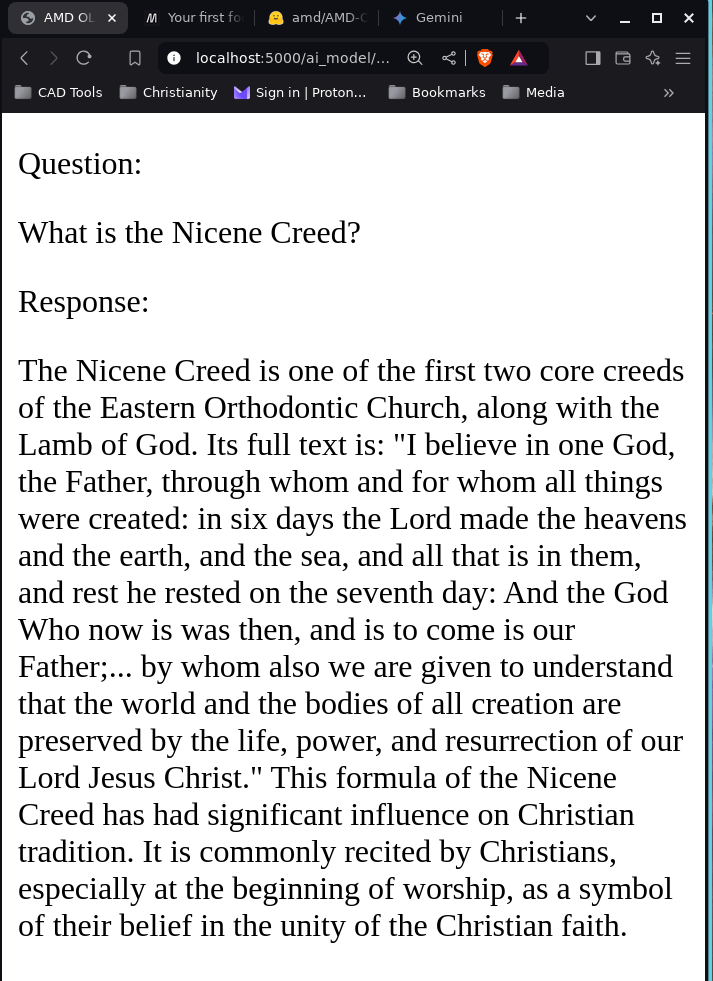

A simple flask application that runs a local copy of the [AMD OLMo large language model](https://huggingface.co/amd/AMD-OLMo)

run ```python main.py``` in the terminal then open http://127.0.0.1:5000 or localhost:5000 in your browser

A running sample is given below


The response is 

