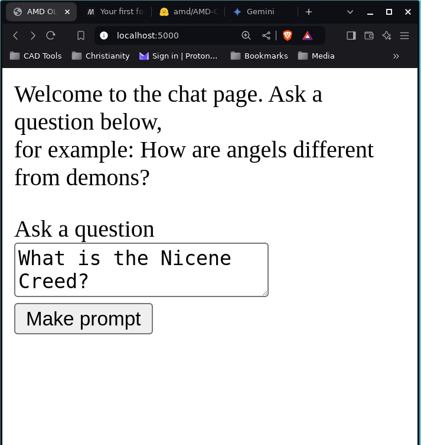

# An LLM Web Application 
A simple flask application that runs a local copy of the [AMD OLMo large language model](https://huggingface.co/amd/AMD-OLMo).

## Instructions
- run ```python main.py``` in the terminal then open http://127.0.0.1:5000 or localhost:5000 in your browser.

**warning:** It took me 1 minute 17 seconds to get a response on my system (an Intel Core i5, 8GB laptop). Model response times would vary based on your device so it would be useful to benchmark your system for exact numbers)

# Sample
A running sample is given below



The response is 


